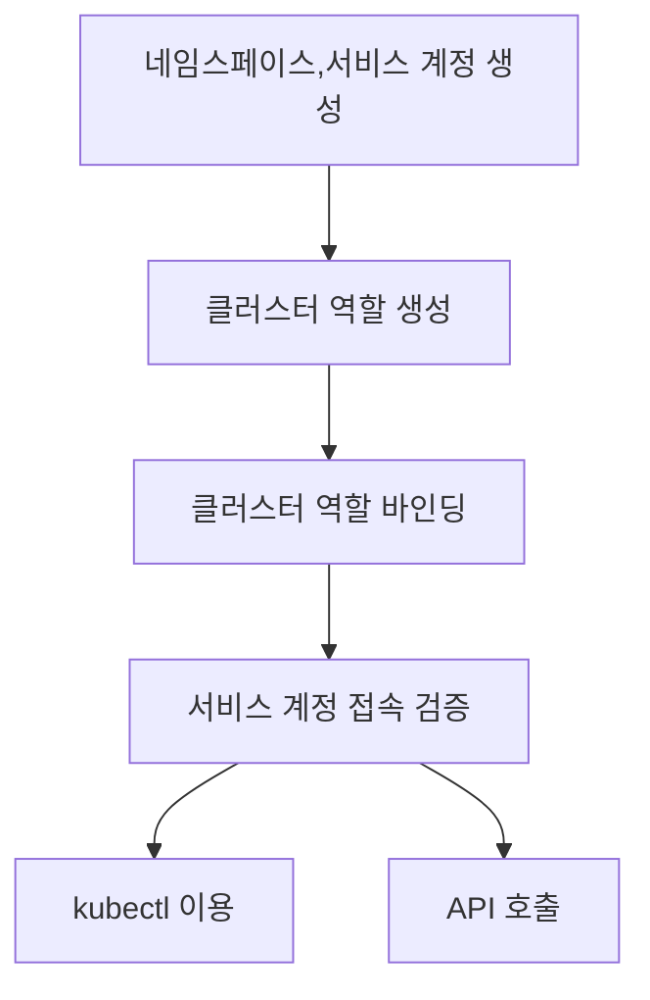

# Access Control

## 1. Security

컨테이너 오케스트레이션의 표준이되고 있는 쿠버네티스에서 보안은 중요하다. 컨테이너 이미지의 안정성, 인증과 권한 및 보안 감사가 중요하다. 취약점 점검에는 **하버(Harbor)**와 같은 **컨테이너 이미지 레지스트리**를 이용할 수 있다. 쿠버네티스 강화 가이드(Kubernetes Hardening Guidance)의 권고 조치는 다음과 같다.

- 취약점이 있거나 구성이 잘못된 컨테이너 및 파드를 점검할 수 있어야 한다.
- **최소한의 권한**으로 컨테이너와 파드를 실행해야 한다.
- **네트워크를 분리**하여 다른 시스템에 영향을 주지 않도록 해야 한다.
- **방화벽**을 사용해 불필요한 네트워크 연결을 차단해야 한다.
- **강력한 인증 및 권한 부여**를 사용해 사용자 및 관리자 접근을 제한해야 한다.
- 관리자가 **모든 활동을 모니터링**하면서 잠재적/악의적 활동에 대응할 수 있도록 **주기적으로 로그 감사**를 해야한다.
- 정기적으로 모든 쿠버네티스 설정을 검토하고 **취약점 스캔 및 보안 패치**가 적용되어 있는지 확인해야 한다.


## 2. RBAC (Role-Based Access Control)

역할 기반으로 쿠버네티스에 접속할 수 있는 권한을 관리하는 것. **사용자(user)와 역할(role) 두가지를 조합하여 사용자에게 권한을 부여**한다. 역할(role)에는 특정 네임스페이스에만 적용되는 **단순 역할**과 클러스터 전체에 적용되는 **클러스터 역할**이 있다.

```yaml
kind: Role
apiVersion: rbac.authorization.k8s.io/v1
metadata:
  namespace: rbac
  name: role
rules:									# 권한에 대한 규칙을 지정
- apiGroups: [""] 			# 역할이 적용될 그룹
  resources: ["pods"]		# 어떤 자원에 접근할지 명시
  verbs: ["get"]				# 어떤 동작이 가능한지 명시
```


### 2.1. 네임스페이스 (Namespace)

쿠버네티스 클러스터 내의 논리적인 구성 단위로 클러스터 내의 리소스 대부분을 네임스페이스 단위로 분리할 수 있다.

- 네임스페이스로 **개발과 운영 환경을 분리**해서 사용할 수 있다.
- 네임스페이스마다 CPU, 메모리 등 개별적으로 리소스를 할당할 수 있어서 **시스템 자원을 유용하게 분배**할 수 있다.


### 2.2. 서비스 어카운트 (Service Account)

**서비스 어카운트는 RBAC 기반의 권한을 관리**한다. 클라이언트가 **쿠버네티스 API를 호출할 때 사용**한다. 즉, 사람에게 부여하는 것이 아니라 **쿠버네티스 API에 접근하는 시스템에 부여하는 권한**이다. 서비스 어카운트는 쿠버네티스에 존재하는 오브젝트이며, 네임스페이스마다 정의할 수 있지만, **각 네임스페이스에는 기본적으로 default 서비스 어카운트가 자동으로 생성**된다.




#### 네임스페이스 생성

```bash
# 'account' 네임스페이스 생성
$ kubectl create namespace account
```

#### 서비스 계정 생성

```bash
# 'api-service-account' 서비스 계정 생성
$ kubectl create serviceaccount api-service-account -n account
$ kubectl get serviceaccount api-service-account -n account
```

#### 클러스터 역할 생성

```yaml
# api-cluster-role.yaml
apiVersion: rbac.authorization.k8s.io/v1
kind: ClusterRole
metadata:
  name: api-cluster-role
  namespace: account  # 앞에서 정의한 네임스페이스 지정
rules:   
  - apiGroups:        # 역할이 사용할 API 그룹들
        - ""
        - apps
        - autoscaling
        - batch
        - extensions
        - policy
        - rbac.authorization.k8s.io
    resources:        # 클러스터의 어떤 리소스(파드, 볼륨 등)에 접근가능한지 지정
      - pods
      - componentstatuses
      - configmaps
      - daemonsets
      - deployments
      - events
      - endpoints
      - horizontalpodautoscalers
      - ingress
      - jobs
      - limitranges
      - namespaces
      - nodes
      - pods
      - persistentvolumes
      - persistentvolumeclaims
      - resourcequotas
      - replicasets
      - replicationcontrollers
      - serviceaccounts
      - services
    verbs: ["get", "list", "watch", "create", "update", "patch", "delete"]
    # 리소스에 접속해서 어떤 것들을 수행할 수 있을지에 대한 행위(verbs)를 지정
```

```bash
# 사용가능한 리소스 확인
$ kubectl api-resources

# 클러스터 역할 생성
$ kubectl apply -f api-cluster-role.yaml
```

#### 클러스터 역할 바인딩

```yaml
# api-cluster-role-binding.yaml
apiVersion: rbac.authorization.k8s.io/v1
kind: ClusterRoleBinding
metadata:
  name: api-cluster-role-binding
subjects:    # 주체는 서비스 어카운트입니다
- namespace: account
  kind: ServiceAccount
  name: api-service-account    
roleRef:
  apiGroup: rbac.authorization.k8s.io
  kind: ClusterRole
  name: api-cluster-role    # api-cluster-role을 api-service-account에 매핑
```

```bash
# 클러스터 역할 바인딩
$ kubectl apply -f api-cluster-role-binding.yaml
```

#### 바인딩 검증(1) - kubectl

```bash
# account 네임스페이스에서 api-service-account 계정으로 파드들 조회 가능 여부 조회
$ kubectl auth can-i get pods --as=system:serviceaccount:account:api-service-account # yes
```

#### 바인딩 검증(2) - POSTMAN

- API(HTTP) 호출 검증에는 서비스 계정과 함께 **서비스 계정과 연결된 토큰이 필요**하다.
- kubernetes 1.24 버전 이후부터는 시크릿을 자동으로 생성하지 않는다.
- 시크릿 이름을 가져올 수 없으므로 토큰 확인도 불가능하다.
- **사용자가 토큰을 직접 생성**할 수 있다.

```bash
##### Before kubernetes 1.24 #####
# 시크릿 이름 조회
$ kubectl get serviceaccount api-service-account -ojsonpath='{.secrets[0].name}' -n account
# 토큰 조회
$ kubectl get secrets <sa-secrets-name> -ojsonpath='{.data.token}' -n account | base --decode

##### After kubernetes 1.24 #####
# 토큰 생성 및 출력
$ kubectl create token api-service-account -n account
```

- 포스트맨으로 아래와 같이 요청
  - 외부에서 요청시 방화벽과 마스터 노드에서 kube-apiserver 포트(6443) 오픈 확인
  - 포스트맨 요청 설정(settings)에서 `SSL certificate verification`를 `OFF`로 변경
  - `Authorization`에서 `Bearer Token`에 base64로 디코딩된 토큰(or 직접생성한 토큰) 입력
  - 주소창에 `https://<cluster-endpoint>/api/v1/namespaces`
    - https://35.216.78.66:6443/api/v1/namespaces
  - 요청 성공시 네임스페이스, UID, 리소스 버전 및 기타 정보가 출력된다.

```bash
# 클러스터 엔드포인트 조회
$ ifconfig # master node IP
$ netstat -nlpt | grep kube-apiserver # k8s-apiserver port(6443) 조회
$ kubectl get endpoints | grep kubernetes # k8s-apiserver port(6443) 조회
```