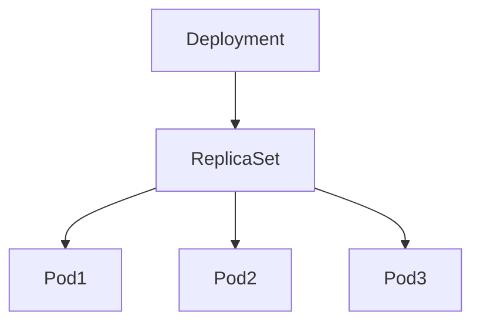
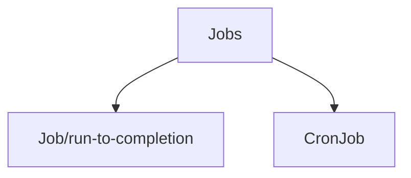

# k8s Resources

## 1. Manifest

쿠버네티스 환경에서 디플로이먼트, 파드와 같은 오브젝트를 어떻게 배포할지에 대한 명세를 담은 YAML 형식의 파일.


## 2. Pod

- 단일 컨테이너 또는 관련 컨테이너들의 그룹

```bash
# At Master Node
$ sudo su -

# Create deployment with pod
$ kubectl create deployment my-httpd --image=httpd --replicas=1 --port=80

# Get deployment & pod info
$ kubectl get deployment -o wide
$ kubectl get pod -o wide # pod-IP: 10.244.1.2 (k8s-worker1)
$ curl 10.244.1.2:80
$ kubectl logs <pod-name>

# Access to pod
$ kubectl exec -it <pod-name> -- /bin/bash

# Update deployment
$ kubectl edit deployment my-httpd

# Delete
$ kubectl delete deployment my-httpd
```


## 3. Deployment & Service

디플로이먼트는 쿠버네티스에서 **상태가 없는(Stateless)** 애플리케이션을 배포할 때 사용



### 3.1. Deploying Strategy

#### 3.1.1. Rolling (무중단 배포)

- 새 버전의 애플리케이션은 하나씩 늘려가고, 기존 버전의 애플리케이션은 하나씩 줄여나가는 방식 (쿠버네티스 표준 배포방식)

- 새 버전의 애플리케이션에 문제가 발생하면, 다시 이전 버전의 파드로 서비스를 대체할 수 있는 안정적인 배포 방식이지만 업데이트가 느리게 진행된다는 단점이 있음


```yaml
# base.yaml
apiVersion: apps/v1
kind: Deployment
metadata:
  name: nginx-deployment
  labels:
    app: nginx
spec:
  replicas: 3
  ### written strategy
  strategy:
    type: RollingUpdate
    rollingUpdate:
      maxSurge: 25%
      maxUnavailable: 25%
  ###
  selector:
    matchLabels:
      app: nginx
  template:
    metadata:
      labels:
        app: nginx
    spec:
      containers:
      - name: nginx
        image: nginx:1.14.2
        ports:
        - containerPort: 80
```

#### 3.1.2. Recreate (중단 배포)

- 모든 이전 버전의 파드를 모두 한번에 종료하고, 새 버전의 파드로 일괄적으로 교체하는 방식.
- 빠르게 업데이트할 수 있지만, 새로운 버전의 파드에 문제가 발생하면 대처가 늦어질 수 있다는 단점이 있음.


```yaml
# base.yaml
...
spec:
  replicas: 3
  strategy:
    type: Recreate
...
```

#### 3.1.3. Blue/Green (무중단 배포)

- 이전 버전과 새 버전이 동시에 운영된다.
- **새 버전**의 파드는 **서비스 목적으로만** 접속할 수 있으며, **이전 버전**의 파드는 **테스트 목적으로만** 접속이 가능하다.
- 새 버전의 파드에 문제가 발생했을 때 **빠르게 대응**할 수 있으며, **안정적으로 배포**할 수 있다.
- 이전 버전과 새 버전이 동시에 운영되므로 그만큼 **많은 자원(CPU, 메모리)이 필요**하다.

|  |  |
| ------------------------------------------------------------ | ------------------------------------------------------------ |

```yaml
# base.yaml
apiVersion: v1
kind: Service
metatdata:
  name: bluegreen
spec:
  selector:
    app: bluegreen
  # 새 버전의 애플리케이션이 안정화되어 이전 버전의 애플리케이션을 삭제하려면 아래와 같이 서비스를 새 버전으로 지정해야함
  # 트래픽이 신규 버전의 애플리케이션으로 변경되는 시점에 버전 업데이트
  version: v1.0.0
...
```

#### 3.1.4. Canary (무중단 배포)

- 이전 버전과 새 버전을 모두 배포하지만, 새 버전에 트래픽을 조금씩 증가시켜 새로운 기능을 테스트
- 테스트가 완료되면 이전 버전은 모두 종료시키고, 새 버전으로만 서비스한다.


### 3.2. Deployment & Service


```yaml
# nginx-deploy.yaml
apiVersion: apps/v1
kind: Deployment
metadata:
  name: nginx-deploy
  labels:
    app: nginx
spec:
  replicas: 2
  selector:
    matchLabels:
      app: nginx
  template:
    metadata:
      labels:
        app: nginx
    spec:
      containers:
      - name: nginx
        image: nginx:1.14.2
        ports:
        - containerPort: 80
```

```yaml
# nginx-svc.yaml
apiVersion: v1
kind: Service
metadata:
  name: nginx-svc
  labels:
    app: nginx
spec:
  type: NodePort
  ports:
  - port: 8080
    nodePort: 31472
    targetPort: 80
  selector:
    app: nginx
```

```bash
$ kubectl apply -f nginx-deploy.yaml
$ kubectl get deployments
$ kubectl get pod -o wide

$ kubectl apply -f nginx-svc.yaml
$ kubectl get svc
```


### Rollback

```bash
# 새로운 이미지로 변경
$ kubectl set image deployment.v1.apps/nginx-deploy nginx=nginx:1.16.1

# 정상 배포 확인
$ kubectl describe deploy nginx-deploy

# 잘못된 버전으로 배포 (1.200 이미지 버전 없음)
$ kubectl set image deployment/nginx-deploy nginx=nginx:1.200

# 업데이트 상태 확인
$ kubectl rollout status deployment/nginx-deploy
$ kubectl get pods # Status: ErrImagePull

# 이전 버전으로 복구
$ kubectl rollout undo deployment/nginx-deploy
$ kubectl rollout status deployment/nginx-deploy
$ kubectl describe deploy nginx-deploy
$ kubectl get pods

# 특정 버전으로 복구
$ kubectl rollout history deployment/nginx-deploy
$ kubectl rollout undo deployment/nginx-deploy --to-revision=3
```


## 4. ReplicaSet

레플리카셋은 일정한 개수의 동일한 파드가 항상 실행되도록 관리한다.

```yaml
# replicaset.yaml
apiVersion: apps/v1
kind: ReplicaSet
metadata:
  name: 3-replicaset
spec:
  template:
    metadata:
      name: 3-replicaset
      labels:
        app: 3-replicaset
    spec:
      containers:
      - name: 3-replicaset
        image: nginx
        ports:
        - containerPort: 80
  replicas: 3
  selector:
    matchLabels:
      app: 3-replicaset
```

```bash
# Create replicaset
$ kubectl apply -f relicaset.yaml
$ kubectl get replicaset,pods

# Delete pod
$ kubectl delete pod 3-replicaset-4mmfk

# 삭제되었지만 레플리카셋에 정의한 파드 수 만큼 다시 새로운 파드 생성됨
$ kubectl get replicaset,pods

# 레플리카 파드 수 수정
$ kubectl scale replicaset/3-replicaset --replicas=5

# 파드는 그대로, 레플리카셋만 삭제
$ kubectl delete -f replicaset.yaml --cascade=orphan
$ kubectl get replicaset,pods
```


## 5. DaemonSet

모든 노드에 파드를 실행할 때 사용한다. 따라서 모든 노드에 필요한 **모니터링 용도**로 많이 사용된다.

```yaml
# daemonsets.yaml
apiVersion: apps/v1
kind: DaemonSet
metadata:
  name: prometheus-daemonset
spec:
  selector:
    matchLabels:
      tier: monitoring
      name: prometheus-exporter
  template:
    metadata:
      labels:
        tier: monitoring
        name: prometheus-exporter
    spec:
      containers:
      - name: prometheus
        image: prom/node-exporter
        ports:
        - containerPort: 80
```

```bash
$ kubectl apply -f daemonsets.yaml
$ kubectl get pod -o wide
$ kubectl describe daemonset/prometheus-daemonset

# Delete DaemonSet (파드도 삭제됨)
$ kubectl delete -f daemonsets.yaml
$ kubectl get pod -o wide
```


## 6. CronJob



- Job: 하나 이상의 파드가 특정한 파드의 정상적인 상태를 유지할 수 있도록 관리 (문제 발생시 새로운 파드 생성)
- CronJob: 주기적으로 지정한 액션을 발생

```bash
# cronjob.yaml
apiVersion: batch/v1
kind: CronJob
metadata:
  name: hello
spec:
  schedule: "*/1 * * * *"
  jobTemplate:
    spec:
      template:
        spec:
          containers:
          - name: hello
            image: busybox
            imagePullPolicy: IfNotPresent
            command:
            - /bin/sh
            - -c
            - date; echo Hello from the Kubernetes cluster
          restartPolicy: OnFailure
```

```bash
$ kubectl create -f cronjob.yaml
$ kubectl get cronjob hello

# 주기적으로 파드가 생성되고 삭제되는 과정이 반복됨
$ kubectl get cronjob -w
$ kubectl get pod -w

# Delete cronjob
$ kubectl delete cronjob hello
```


## 7. CoreDNS

- 쿠버네티스에서 사용하는 DNS(Domain Name System)
- 클러스터를 지속적으로 모니터링하며 새로운 서비스나 파드가 생성되면 DNS를 업데이트 한다.
- kubeadm으로 설치시 CoreDNS 기본설치

```bash
# CoreDNS는 2개의 파드로 구성됨
$ kubectl get pod -n kube-system -l k8s-app=kube-dns

# TCP/UDP 사용 포트(53) 확인
$ kubectl get svc -n kube-system -l k8s-app=kube-dns

# Get CoreNDS Corefile using ConfigMap
$ kubectl describe cm -n kube-system coredns
```

```bash
# 임시 파드 생성
$ kubectl run -it --rm \
  busybox \
  --image=busybox \
  --restart=Never \
  -- cat /etc/resolv.conf
  
# 파드가 생성될 때 kubelet은 /etc/resolv.conf에 CoreDNS를 가리키는 IP 주소(10.96.0.10)를 nameserver로 등록
# nameserver: CoreDNS의 IP 주소
# search: DNS에 질의하는 부분으로 도메인 주소를 표시
# ndots: 도메인에 포함될 점(.)의 최소 개수 (www.a.com -> 2)
```


## 8. ConfigMap & Secret

#### 8.1. ConfigMap

- ConfigMap은 환경변수 같은 값을 도커 이미지에 포함시키지 않고 별도로 분리해서 관리하는 방법을 제공한다.

- 기밀이 아닌 데이터를 key-value 쌍으로 저장하는데 사용

```bash
# Key-Value 전달로 ConfigMap 설정
$ kubectl create configmap my-config --from-literal=JAVA_HOME=/usr/java --from-literal=URL=http://localhost:8000

# 파일/디렉토리로 ConfigMap 설정
$ kubectl create configmap configmap-file --from-file configmap_test.html
$ kubectl describe configmap configmap-file

# 환경파일로 ConfigMap 설정
$ kubectl create configmap configmap-envfile --from-env-file configmap_test.env
```

#### 8.2. Secret

- 외부에 노출되어서는 안되는 정보를 저장할 때 사용
- 컨테이너에 저장하지 않고 별도로 보관해 두었다가 실제 파드가 실행될 때 시크릿 값을 가져와서 파드에 넘겨준다.

```bash
$ kubectl create secret generic dbuser --from-literal=username=testuser --from-literal=password=1234